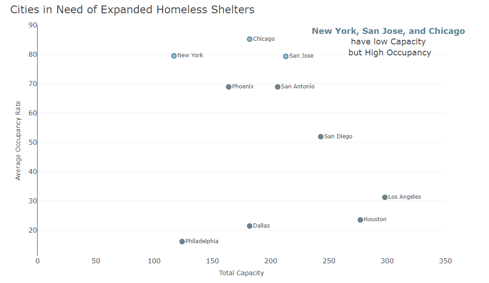

```{=html}
<style type="text/css">
.main-container {
  max-width: 90% !important;
  margin: auto;
}
</style>

<div class="banner">
  <div class="container">
    <h1 class="banner-title">Kristiana Reed's Portfolio</h1>
    <p class="banner-subtitle">
      A Collection of Data Analysis, Data Visualization, and Machine Learning Projects.
    </p>
    <p> Contact me via my
      <a href="https://www.linkedin.com/in/kristiana-reed" class="banner-link" target="_blank">LinkedIn Profile</a>
    </p>
  </div>
</div>


<!-- <div class="btn-group filter-buttons"> -->
<!--   <button class="btn btn-primary active" data-filter="all">Show all</button>  -->
<!--   <button class="btn btn-outline-primary" data-filter="analysis">Data Analysis</button>  -->
<!--   <button class="btn btn-outline-primary" data-filter="dashboard">Dashboards</button> -->
<!--   <button class="btn btn-outline-primary" data-filter="machine_learning">Machine Learning</button>  -->
<!-- </div> -->

<div class="row portfolio">
   <div class="col-md-4 project-card analysis">
      <div class="card">
          
         <div class="card-body">
            <h5 class="card-title">Sheltering the Homeless</h5>
            <p class="card-text">An analysis on which shelters are under the most occupancy stress</p>
            <a href="HomelessShelterAnalysis.html" class="btn btn-sm btn-primary">View Project</a> 
         </div>
      </div>
   </div>
</div>

<script>
document.addEventListener("DOMContentLoaded", function() {
  const buttons = document.querySelectorAll(".filter-buttons button");
  const cards = document.querySelectorAll(".project-card");

  function filterProjects(filter) {
    cards.forEach(card => {
      if (filter === "all" || card.classList.contains(filter)) {
        card.classList.add("show");
      } else {
        card.classList.remove("show");
      }
    });
  }

  buttons.forEach(btn => {
    btn.addEventListener("click", () => {
      // Reset all buttons to outline style
      buttons.forEach(b => {
        b.classList.remove("btn-primary");
        b.classList.add("btn-outline-primary");
      });

      // Highlight the clicked button
      btn.classList.remove("btn-outline-primary");
      btn.classList.add("btn-primary");

      // Filter projects
      const filter = btn.getAttribute("data-filter");
      filterProjects(filter);
    });
  });

  // Show all by default
  filterProjects("all");
});
</script>
```
