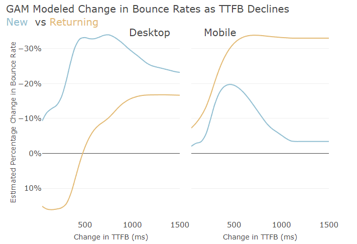
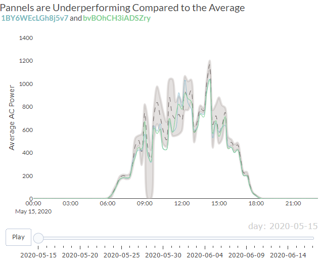
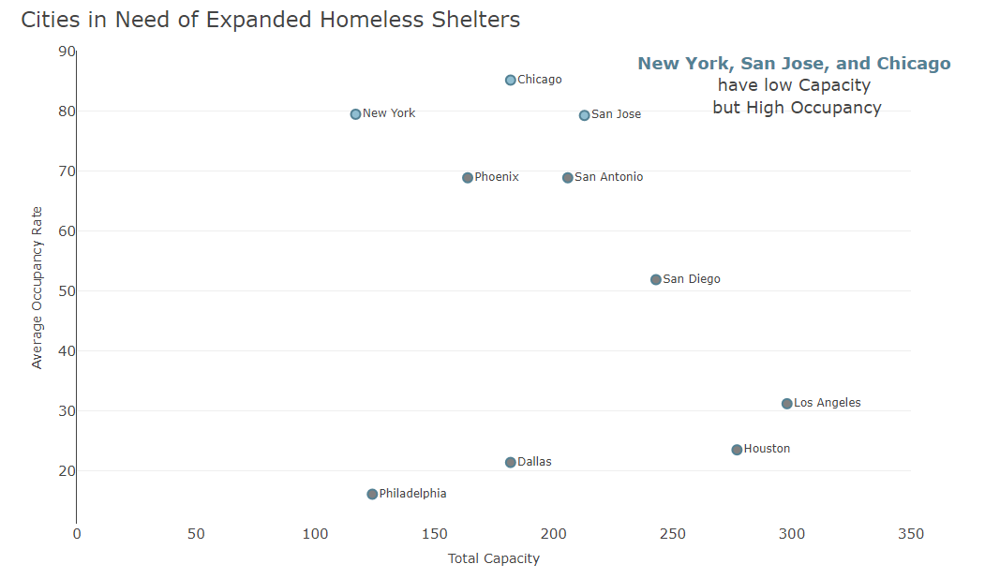

```{=html}
<style type="text/css">
.main-container {
  max-width: 90% !important;
  margin: auto;
}
</style>

<div class="banner">
  <div class="container">
    <h1 class="banner-title">Kristiana Reed's Portfolio</h1>
    <p class="banner-subtitle">
      A collection of Data Analysis, Data Visualization, and Machine Learning projects.
    </p>
    <div class="banner-links">
      <a href="https://www.linkedin.com/in/kristiana-reed" class="banner-link" target="_blank">
        &#128101; LinkedIn
      </a>
    </div>
  </div>
</div>

<p class="section-heading">Projects</p>

<div class="btn-group filter-buttons">
  <button class="btn btn-primary active" data-filter="all">Show All</button>
  <button class="btn btn-outline-primary" data-filter="analysis">Data Analysis</button>
  <button class="btn btn-outline-primary" data-filter="machine_learning">Machine Learning</button>
</div>

<div class="row portfolio">
  <div class="col-md-4 project-card machine_learning">
    <div class="card">
      
      <div class="card-body">
        <span class="card-badge badge-ml">Machine Learning</span>
        <h5 class="card-title">Bounce Rate and TTFB Correlation</h5>
        <p class="card-text">Using a GAM to answer: "If TTFB improves by x milliseconds, how much will bounce rate improve?"</p>
        <a href="BounceRateImactAnalysis.html" class="btn btn-sm btn-primary">View Project</a>
      </div>
    </div>
  </div>
  <div class="col-md-4 project-card analysis">
    <div class="card">
      
      <div class="card-body">
        <span class="card-badge badge-analysis">Data Analysis</span>
        <h5 class="card-title">Solar Power Plant Monitoring</h5>
        <p class="card-text">Evaluate performance of solar panel power generation to identify maintenance needs and potential issues.</p>
        <a href="SolarPowerAnalysis.html" class="btn btn-sm btn-primary">View Project</a>
      </div>
    </div>
  </div>
  <div class="col-md-4 project-card analysis">
    <div class="card">
      
      <div class="card-body">
        <span class="card-badge badge-analysis">Data Analysis</span>
        <h5 class="card-title">Sheltering the Homeless</h5>
        <p class="card-text">An analysis identifying which shelters are under the most occupancy stress.</p>
        <a href="HomelessShelterAnalysis.html" class="btn btn-sm btn-primary">View Project</a>
      </div>
    </div>
  </div>
</div>

<script>
document.addEventListener("DOMContentLoaded", function() {
  const buttons = document.querySelectorAll(".filter-buttons button");
  const cards = document.querySelectorAll(".project-card");

  function filterProjects(filter) {
    cards.forEach(card => {
      if (filter === "all" || card.classList.contains(filter)) {
        card.classList.add("show");
      } else {
        card.classList.remove("show");
      }
    });
  }

  buttons.forEach(btn => {
    btn.addEventListener("click", () => {
      buttons.forEach(b => {
        b.classList.remove("btn-primary");
        b.classList.add("btn-outline-primary");
      });
      btn.classList.remove("btn-outline-primary");
      btn.classList.add("btn-primary");
      filterProjects(btn.getAttribute("data-filter"));
    });
  });

  filterProjects("all");
});
</script>
```
